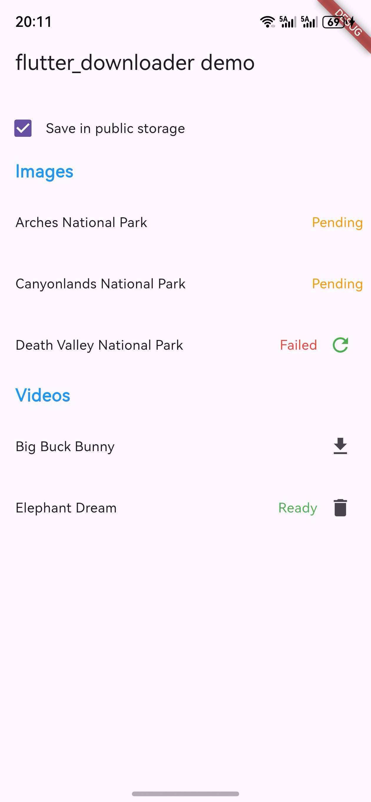

# flutter_downloader_ohos 📦

> OpenHarmony 平台的下载管理插件，基于 [flutter_downloader](https://pub.dev/packages/flutter_downloader) 开发。

## 📥 安装

本项目为联合插件，需与原版 `flutter_downloader` 配合使用。

```yaml
dependencies:
  flutter_downloader: ^1.12.0
  flutter_downloader_ohos: ^1.12.0
```

```bash
flutter pub get
```

详细使用示例请参考 [example](example/)。

## 🔧 API

> 💡 使用方法与原版 `flutter_downloader` 一致，效果对标 iOS / Android。

### FlutterDownloader

| 方法名              | 说明                             | OpenHarmony |
|---------------------|----------------------------------|-------------|
| initialize          | 初始化插件，必须最先调用           | ✅ |
| enqueue             | 创建新下载任务并返回唯一标识符     | ⚠️ 部分支持 |
| loadTasks           | 从数据库加载所有下载任务           | ✅ |
| loadTasksWithRawQuery | 通过 SQL 查询加载任务            | ✅ |
| cancel              | 取消指定下载任务                   | ✅ |
| cancelAll           | 取消所有排队/运行中的任务           | ✅ |
| pause               | 暂停正在运行的下载任务             | ✅ |
| resume              | 恢复已暂停的任务                   | ✅ |
| retry               | 重试失败的下载任务                 | ✅ |
| remove              | 从数据库删除任务（可选删除文件）    | ✅ |
| open                | 打开已下载的文件                   | ✅ |
| registerCallback    | 注册下载状态更新回调               | ✅ |

## 📋 属性

### 下载任务状态 (DownloadTaskStatus)

| 状态       | 说明                       | OpenHarmony |
|------------|----------------------------|-------------|
| undefined  | 任务状态未知或已损坏        | ✅ |
| enqueued   | 任务已排队，尚未运行        | ✅ |
| running    | 任务正在执行中              | ✅ |
| complete   | 任务已成功完成              | ✅ |
| failed     | 任务执行失败                | ✅ |
| canceled   | 任务已取消，无法恢复        | ✅ |
| paused     | 任务已暂停，可以恢复        | ✅ |

### 下载任务 (DownloadTask)

| 属性          | 说明                       | OpenHarmony |
|---------------|----------------------------|-------------|
| taskId        | 任务的唯一标识符            | ✅ |
| status        | 任务当前状态                | ✅ |
| progress      | 下载进度（0-100）           | ✅ |
| url           | 文件下载的源地址            | ✅ |
| filename      | 下载文件的本地名称          | ✅ |
| savedDir      | 文件保存的绝对路径          | ✅ |
| timeCreated   | 任务创建时间戳              | ✅ |
| allowCellular | 是否允许使用蜂窝网络下载    | ✅ |

## 📸 截图



## 📄 开源协议

本项目基于 [MIT](LICENSE) 协议，请自由地享受和参与开源。
